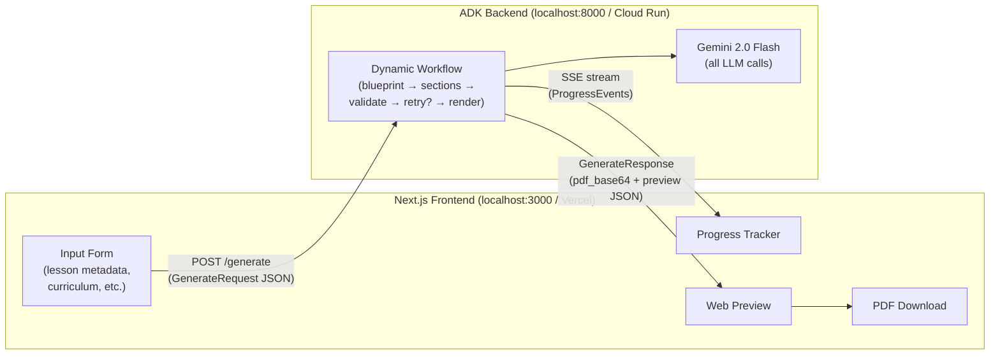
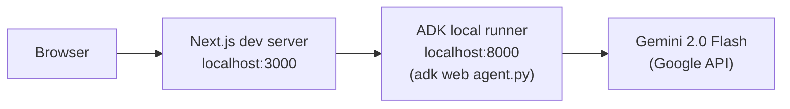
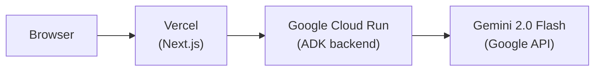

# Architecture
## Study Guide Generation Web App

> This document should be read alongside `IFC.md`. Every architectural decision here is traceable to a criterion in that document.

---

## Table of contents

1. [System overview](#1-system-overview)
2. [Tech stack decisions](#2-tech-stack-decisions)
3. [Repository structure](#3-repository-structure)
4. [ADK agent graph](#4-adk-agent-graph)
5. [Graph nodes reference](#5-graph-nodes-reference)
6. [Data contracts](#6-data-contracts)
7. [Validation layer](#7-validation-layer)
8. [Rendering pipeline](#8-rendering-pipeline)
9. [Frontend architecture](#9-frontend-architecture)
10. [Deployment architecture](#10-deployment-architecture)
11. [Key design decisions and alternatives considered](#11-key-design-decisions-and-alternatives-considered)

---

## 1. System overview

The system is a web application with two logical layers: a **Next.js frontend** that collects teacher inputs and displays results, and an **ADK agent graph** that drives all generation, validation, and retry logic on the backend.

The frontend and backend communicate over a single HTTP endpoint. The frontend sends a structured lesson request and streams progress events back; the backend runs the full dynamic workflow and returns a completed PDF and a structured web preview payload.



---

## 2. Tech stack decisions

| Layer | Choice | Reason |
|---|---|---|
| Frontend framework | Next.js 14 (App Router) | Single repo for UI and API proxy; SSE streaming support built in |
| Styling | Tailwind CSS | Utility-first, no design system overhead for a prototype |
| Agent framework | Google ADK 2.0 Python (dynamic workflows) | `@node` + `ctx.run_node()` with automatic checkpointing; conditional retry via `while` loop; native Gemini integration |
| LLM | Gemini 2.0 Flash | Best cost/latency ratio for 17 sequential/parallel calls; ADK has first-class Gemini support |
| PDF rendering | WeasyPrint (Python) | HTML/CSS → PDF with full layout control; runs server-side in the ADK process |
| Web preview | Structured JSON → React components | Preview is assembled from the same section JSON that feeds the PDF renderer |
| Deployment (Phase 1) | Local — Next.js dev server + `adk web` local runner | Fastest iteration loop; no infrastructure required |
| Deployment (Phase 2) | Vercel (frontend) + Google Cloud Run (ADK) | ADK deploys natively to Cloud Run; `ADK_BACKEND_URL` env var switches the proxy target |

### Why ADK dynamic workflows over graph-based workflows or a plain orchestrator

ADK 2.0 offers two workflow styles. **Graph-based workflows** define execution as a static `edges` array with `JoinNode` for fan-out and `Event(route=...)` for branching. **Dynamic workflows** use the `@node` decorator and `ctx.run_node()` called from plain Python code, with automatic checkpointing of each node execution.

Dynamic workflows are chosen for this project for three specific reasons:

1. **Automatic checkpointing for retry.** When the workflow resumes after a validation failure, ADK's deterministic execution IDs mean nodes that already completed are automatically skipped. Retrying only the failed sections requires a `while` loop calling `ctx.run_node()` — not 16 explicit retry edges in a graph definition.

2. **Readable parallel execution.** `asyncio.gather()` inside a `@node` function expresses wave-based parallel execution in standard Python. The graph-based equivalent requires a `JoinNode` per wave and careful `edges` array construction that becomes unwieldy at 16 sections.

3. **Future agent extensibility.** Adding a reading-level validator or curriculum alignment step requires adding one `ctx.run_node()` call in the workflow function, not restructuring an `edges` array and registering new routes.

---

## 3. Repository structure

```
/
├── frontend/                        # Next.js 14 application
│   ├── app/
│   │   ├── layout.tsx
│   │   ├── page.tsx                 # Input form + generation UI
│   │   └── api/
│   │       └── generate/
│   │           └── route.ts         # Proxy to ADK backend + SSE stream
│   ├── components/
│   │   ├── InputForm.tsx
│   │   ├── ProgressTracker.tsx
│   │   ├── WebPreview.tsx           # Renders section JSON as styled HTML
│   │   └── DownloadButton.tsx
│   ├── lib/
│   │   └── types.ts                 # Shared TypeScript types (mirrored from backend)
│   └── package.json
│
└── backend/                         # ADK project root — run `adk web` from here
    ├── study_guide_agent/           # ADK agent package (required structure)
    │   ├── __init__.py              # Required by ADK
    │   ├── agent.py                 # root_agent lives here — ADK entry point
    │   └── .env                    # GOOGLE_API_KEY (gitignored)
    ├── nodes/
    │   ├── base.py                  # Shared Gemini client + call wrapper
    │   ├── blueprint.py             # Node: generate blueprint JSON
    │   ├── sections/
    │   │   ├── intro.py
    │   │   ├── learning_targets.py
    │   │   ├── warmup.py
    │   │   ├── vocabulary.py
    │   │   ├── core_explainer.py
    │   │   ├── subconcept.py        # Called once per sub-competency
    │   │   ├── strategy_list.py
    │   │   ├── deep_dive.py
    │   │   ├── model_passage.py
    │   │   ├── check_in.py          # Depends on: model_passage
    │   │   ├── key_points.py
    │   │   ├── assessment_passage.py
    │   │   ├── assessment_questions.py  # Depends on: assessment_passage
    │   │   ├── step_up.py           # Depends on: assessment_questions
    │   │   ├── self_assessment.py
    │   │   └── answer_key.py        # Always last
    │   ├── validator.py             # Node: runs all hard + soft validators
    │   └── renderer.py              # Node: assembles validated JSON → PDF + preview JSON
    ├── prompts/
    │   ├── system_prompt.py         # Global system prompt builder
    │   └── templates/               # One prompt template function per section type
    ├── validators/
    │   ├── hard/
    │   │   ├── vocab_presence.py
    │   │   ├── self_assess_targets.py
    │   │   ├── answer_key_quotes.py
    │   │   ├── passage_domain_diff.py
    │   │   └── json_schema.py
    │   └── soft/
    │       ├── answer_leakage.py
    │       └── reading_level.py
    ├── templates/
    │   └── study_guide.html.j2      # Jinja2 template for WeasyPrint PDF
    ├── evals/                       # ADK eval test cases
    │   ├── english_grade6_ph.json
    │   └── math_grade4_vn.json
    ├── types.py                     # Pydantic models for all data contracts
    └── requirements.txt
```

**Key structural rule:** ADK's `adk web` and `adk run` commands are run from `backend/` (the parent directory). ADK discovers the agent by finding the `study_guide_agent/` subdirectory containing `__init__.py` and `agent.py` with a `root_agent` defined. All other backend code (`nodes/`, `prompts/`, `validators/`) lives at the `backend/` level and is imported by `agent.py` using relative imports.

---

## 4. ADK dynamic workflow

The backend is implemented as an ADK 2.0 **dynamic workflow** using the `@node` decorator and `ctx.run_node()`. This is distinct from ADK's graph-based workflow (`Workflow` + `edges` array) — dynamic workflows express execution order as plain Python code with automatic checkpointing of every node execution.

### Why dynamic workflow over graph-based workflow

ADK 2.0 offers both styles. Graph-based workflows suit simple linear or branching pipelines. Dynamic workflows are chosen here because:

- Retry logic for failed sections is a `while` loop — not 16 explicit retry edges in an `edges` array
- Wave parallelism is `asyncio.gather()` — not a `JoinNode` per wave
- Checkpointing is automatic — nodes that completed are skipped on resume without any manual state bookkeeping

### Workflow structure

```mermaid
flowchart TD
    START(["START\n(GenerateRequest written\nto context)"])
    BP["blueprint_node\n(generates shared Blueprint JSON)"]

    subgraph Wave1 ["Wave 1 — asyncio.gather() — blueprint only"]
        W1A["intro_node"]
        W1B["learning_targets_node"]
        W1C["warmup_node"]
        W1D["vocabulary_node"]
        W1E["key_points_node"]
        W1F["self_assessment_node"]
    end

    subgraph Wave2 ["Wave 2 — asyncio.gather() — blueprint only"]
        W2A["core_explainer_node"]
        W2B["subconcept_node ×N\n(one per sub-competency)"]
        W2C["strategy_list_node"]
        W2D["deep_dive_node"]
        W2E["model_passage_node"]
        W2F["assessment_passage_node"]
    end

    subgraph Wave3 ["Wave 3 — depends on Wave 2 outputs"]
        W3A["check_in_node\n(depends on: model_passage)"]
        W3B["assessment_questions_node\n(depends on: assessment_passage)"]
        W3C["step_up_node\n(depends on: assessment_questions)"]
    end

    AK["answer_key_node\n(always last — depends on\ncheck_in + assessment_questions)"]

    VAL["validator_node\n(runs all hard + soft validators)"]

    RETRY{"validation\npassed?"}

    subgraph RetryLoop ["Retry loop — while failed_sections:"]
        RL["ctx.run_node() for each\nfailed section only\n(RETRY_CONTEXT appended to prompt)"]
        RVAL["validator_node\n(second pass)"]
    end

    RENDER["renderer_node\n(Jinja2 → WeasyPrint → PDF\n+ WebPreviewPayload JSON)"]
    END(["END\n(GenerateResponse returned)"])

    START --> BP
    BP --> Wave1
    Wave1 --> Wave2
    Wave2 --> Wave3
    Wave3 --> AK
    AK --> VAL
    VAL --> RETRY
    RETRY -- "yes" --> RENDER
    RETRY -- "no" --> RetryLoop
    RetryLoop --> RENDER
    RENDER --> END
```



### agent.py skeleton

The entry point uses ADK's `Workflow` with a single dynamic workflow node as the orchestrator:

```python
from google.adk import Workflow
from google.adk import node, Context
import asyncio

@node(rerun_on_resume=True)
async def study_guide_workflow(ctx: Context, request: GenerateRequest):
    # Stage 1 — blueprint
    blueprint = await ctx.run_node(blueprint_node, request)

    # Stage 2 — Wave 1 (parallel, blueprint only)
    wave1_results = await asyncio.gather(
        ctx.run_node(intro_node, blueprint),
        ctx.run_node(learning_targets_node, blueprint),
        ctx.run_node(warmup_node, blueprint),
        ctx.run_node(vocabulary_node, blueprint),
        ctx.run_node(key_points_node, blueprint),
        ctx.run_node(self_assessment_node, blueprint),
    )

    # Stage 2 — Wave 2 (parallel, blueprint only)
    wave2_results = await asyncio.gather(
        ctx.run_node(core_explainer_node, blueprint),
        *[ctx.run_node(subconcept_node, (blueprint, i))
          for i in range(len(blueprint.sub_competencies))],
        ctx.run_node(strategy_list_node, blueprint),
        ctx.run_node(deep_dive_node, blueprint),
        ctx.run_node(model_passage_node, blueprint),
        ctx.run_node(assessment_passage_node, blueprint),
    )

    # Stage 2 — Wave 3 (sequential dependencies within wave)
    model_passage, assessment_passage = wave2_results[-2], wave2_results[-1]
    check_in = await ctx.run_node(check_in_node, (blueprint, model_passage))
    assessment_questions = await ctx.run_node(
        assessment_questions_node, (blueprint, assessment_passage)
    )
    step_up = await ctx.run_node(
        step_up_node, (blueprint, assessment_passage, assessment_questions)
    )

    # Stage 3 — answer key (always last)
    answer_key = await ctx.run_node(
        answer_key_node, (blueprint, check_in, assessment_questions)
    )

    # Stage 4 — validate; retry failed sections once
    all_sections = {... all section outputs ...}
    validation = await ctx.run_node(validator_node, all_sections)

    retry_count = 0
    while not validation.passed and retry_count < 1:
        for section_key in validation.failed_sections:
            # ctx.run_node with a new node instance forces re-execution
            # even though the original node was checkpointed
            all_sections[section_key] = await ctx.run_node(
                retry_node_for(section_key, validation.failures[section_key]),
                (blueprint, all_sections),
            )
        validation = await ctx.run_node(validator_node, all_sections)
        retry_count += 1

    # Stage 5 — render
    return await ctx.run_node(renderer_node, (blueprint, all_sections, validation))


root_agent = Workflow(
    name="study_guide_generator",
    edges=[("START", study_guide_workflow)],
)
```

### Execution waves

| Wave | Nodes | Runs via |
|---|---|---|
| 0 | `blueprint_node` | `await ctx.run_node()` — sequential |
| 1 | `intro`, `learning_targets`, `warmup`, `vocabulary`, `key_points`, `self_assessment` | `asyncio.gather()` — parallel |
| 2 | `core_explainer`, `subconcept` ×N, `strategy_list`, `deep_dive`, `model_passage`, `assessment_passage` | `asyncio.gather()` — parallel |
| 3 | `check_in`, `assessment_questions`, `step_up` | mixed — `check_in` and `assessment_questions` parallel; `step_up` sequential after both |
| 4 | `answer_key` | `await ctx.run_node()` — sequential, always last |
| 5 | `validator` | `await ctx.run_node()` — sequential |
| 6 | retry loop (failed sections only) | `while` loop + `ctx.run_node()` — one retry per failed section |
| 7 | `renderer` | `await ctx.run_node()` — sequential |


---

## 5. Workflow nodes reference

### blueprint_node

Decorated with `@node`. Reads the `GenerateRequest` from its input, builds the system prompt and blueprint prompt, calls Gemini, validates and returns a `Blueprint` object. All subsequent nodes receive the blueprint as part of their input — it is never stored in a separate session state object; instead `ctx.run_node()` passes it directly as a function argument.

### Section generation nodes (Waves 1–4)

Each section node is a `@node`-decorated function following this pattern:

1. Receive `blueprint` (and any dependency outputs) as input from `ctx.run_node()`
2. Build a section-specific prompt using the corresponding template from `prompts/templates/`
3. Call Gemini 2.0 Flash with `response_mime_type="application/json"`
4. Parse and structurally validate the JSON response (schema check only — content validation happens in the validator node)
5. Return the parsed dict

Because `ctx.run_node()` returns outputs directly, there is no session state dictionary to read from or write to. Dependency data is threaded through function arguments by the `study_guide_workflow` orchestrator node.

The `subconcept_node` is called once per sub-competency using a list comprehension inside `asyncio.gather()`. The orchestrator node handles this loop — not a framework-level `LoopNode`.

The `answer_key_node` explicitly receives `check_in`, `assessment_questions`, and `assessment_passage` outputs as inputs. It is the only node that assembles cross-section content.

### validator_node

Decorated with `@node`. Receives all section outputs as a dict. Runs all hard and soft validators. Returns a `ValidationResult`. Does not raise exceptions — all failures are captured in the return value.

### retry_node_for(section_key, failure_messages)

Not a fixed node — the orchestrator creates a new node instance per failed section using a factory function. The retry node uses the same prompt template as the original generation pass but prepends a `RETRY_CONTEXT` block to the user prompt containing the specific failure message from the validator. This gives Gemini targeted correction guidance.

Because each retry node is a new instance with a distinct name, ADK's checkpointing system treats it as a fresh execution rather than skipping it as already-completed.

### renderer_node

Decorated with `@node`. Receives blueprint, all section outputs, and validation result. Produces two outputs: a base64-encoded PDF binary (via Jinja2 + WeasyPrint) and a `WebPreviewPayload` JSON object for the React frontend. Returns both as a single dict.

Both outputs are written to session state and returned to the frontend in the final response payload.

---

## 6. Data contracts

All contracts are defined as Pydantic models in `backend/types.py` and mirrored as TypeScript interfaces in `frontend/lib/types.ts`. The JSON schema is the source of truth.

### GenerateRequest

Sent from the frontend to the ADK backend as the initial payload.

```
GenerateRequest
  lesson_metadata:
    subject: string
    grade_level: int (1–12)
    market: string ("PH" | "JP" | "VN" | free text)
    language: string (default "en")
    unit_number: int
    unit_title: string
    lesson_number: int
    lesson_title: string
    lesson_code: string
  curriculum:
    competency_code: string
    competency_description: string
    sub_competencies: SubCompetency[]
      id: string
      label: string
  instructional_design:
    core_concept: string
    bloom_targets: string[3]
    essential_question_seed: string
  optional:
    vocabulary_seeds?: string[]
    topic_domains?: Record<string, string>
    tone_register?: string (default "warm-formal")
    length_preset?: "short" | "standard" | "long" (default "standard")
```

### Blueprint

Written to session state by the blueprint node. Read by all section nodes.

```
Blueprint
  lesson_id: string
  title: string
  essential_question: string
  introduction_hook: string
  learning_targets: LearningTarget[]
    number: int
    bloom_verb: string
    objective: string
  vocabulary: VocabEntry[]
    word: string
    definition: string
    example_sentence: string
  topic_domains:
    model_passage: string
    assessment_passage: string   # must differ from model_passage
    entertain_example: string
    inform_example: string
    persuade_example: string
  sub_competencies: SubCompetency[]
  core_concept: string
```

### GenerateResponse

Returned from ADK backend to the Next.js proxy on completion.

```
GenerateResponse
  success: bool
  pdf_base64: string              # base64-encoded PDF binary
  preview: WebPreviewPayload      # structured section data for React preview
    sections: PreviewSection[]
      section_id: string
      section_type: string
      title: string
      content: object             # shape varies by section_type; documented per-section
  validation:
    passed: bool
    warnings: string[]            # soft validator warnings to surface in UI
    retried_sections: string[]    # sections that were retried during validation pass
  error?: string                  # present only on failure
```

### ProgressEvent

Streamed from the Next.js proxy to the browser via SSE during generation.

```
ProgressEvent
  type: "node_started" | "node_complete" | "validation_started"
       | "retry_started" | "render_started" | "done" | "error"
  node: string                    # e.g. "blueprint", "intro", "validator"
  message?: string
  timestamp: ISO8601 string
```

---

## 7. Validation layer

### Hard validators

Hard validators block document assembly. A section that fails a hard validator is retried once. If the retry also fails, the document is assembled with a visible warning on the affected section.

| Validator | What it checks | Section(s) it applies to |
|---|---|---|
| `vocab_presence` | Every vocabulary word from the blueprint appears (case-insensitive) in the combined body section text | All body sections collectively |
| `self_assess_targets` | Each skill row in the self-assessment matches a learning target objective verbatim | `self_assessment` |
| `answer_key_quotes` | Each possible answer in the answer key contains a verbatim phrase from the assessment passage | `answer_key` |
| `passage_domain_diff` | The topic domain of the assessment passage differs from the model passage domain | `assessment_passage` |
| `json_schema` | Each section output parses correctly against its expected JSON schema | All section nodes |

### Soft validators

Soft validators produce warnings that are surfaced to the user in the web preview but do not block assembly or trigger retries.

| Validator | What it checks |
|---|---|
| `answer_leakage` | Body sections do not contain verbatim phrases that appear in the answer key possible answers |
| `reading_level` | Each section's Flesch-Kincaid grade score falls within ±1.0 of the target grade band |

### Retry logic

When the validator node returns `passed=False`, the `study_guide_workflow` orchestrator node enters a `while` loop. For each section key in `validation.failed_sections`, it calls `ctx.run_node()` with a retry node instance created by the `retry_node_for()` factory. The retry node appends a `RETRY_CONTEXT` block to the prompt describing the specific constraint that was violated, giving Gemini targeted correction guidance rather than regenerating blindly.

After all failed sections are retried, the validator runs a second time. The `while` loop condition limits retries to one pass — on a second failure the section is included as `best_effort` in the final `ValidationResult` and the warning is surfaced to the user in the web preview.

Because ADK dynamic workflows checkpoint each node execution by deterministic execution ID, a mid-run timeout or infrastructure failure resumes from the last successful node — not from the start of the workflow.

---

## 8. Rendering pipeline

The renderer node runs after all sections have passed validation (or been flagged as best-effort). It produces two outputs in parallel.

### PDF rendering

The renderer populates a Jinja2 HTML template with the validated section content, then passes the rendered HTML to WeasyPrint to produce a PDF binary. The HTML template defines:

- Page margins and size (A4)
- Section order (hardcoded in the template — matches the fixed 17-section structure)
- Heading hierarchy (H1 for the lesson title, H2 for section titles, H3 for sub-concept titles)
- Table structures for vocabulary (4 columns: word, part of speech, definition, example) and self-assessment (skill × 3 confidence columns)
- Page break rules: the answer key always begins on a new page; the assessment passage begins on a new page
- House style CSS: font family, font sizes per grade band, line height, colour palette

### Web preview rendering

The renderer also produces a `WebPreviewPayload` JSON object that mirrors the PDF structure but is shaped for React consumption. Each section in the payload includes its `section_type`, a `title`, and a `content` object whose shape is documented per-section type. The React `WebPreview` component maps `section_type` to a dedicated sub-component that handles the rendering of that section's specific content structure (e.g. `VocabularySection` renders a table, `PassageSection` renders styled paragraphs with annotations).

---

## 9. Frontend architecture

### Page structure

The application is a single-page experience on `app/page.tsx`. It has two states: the input form (pre-generation) and the results view (post-generation). The transition between them is managed by a top-level `useState` tracking the generation stage.

### Input form

`InputForm.tsx` is a fully controlled form with four field groups:

- **Lesson metadata** — subject, grade level, market, language, unit, lesson identifiers
- **Curriculum** — competency code, description, and a dynamic sub-competency list (add/remove rows)
- **Instructional design** — core concept, three Bloom targets, essential question seed
- **Optional inputs** — collapsible; vocabulary seeds, topic domain overrides, tone register, length preset

On submit, the form serialises to a `GenerateRequest` and POSTs to `app/api/generate/route.ts`.

### Progress tracker

`ProgressTracker.tsx` consumes the SSE stream from the API proxy and renders a vertical step list. Each `node_complete` event checks off the corresponding step. The tracker shows the current active node and elapsed time.

### Results view

On `done` event receipt, the results view renders two tabs: **Web Preview** and **Download PDF**.

The Web Preview tab renders `WebPreview.tsx`, which maps the `WebPreviewPayload` sections to their respective React sub-components. Soft validator warnings are displayed as amber inline callouts on the affected sections. Best-effort sections are marked with a visible badge.

The Download PDF tab renders `DownloadButton.tsx`, which decodes the `pdf_base64` field and triggers a browser file download.

### API proxy route

`app/api/generate/route.ts` is a thin proxy. It forwards the `GenerateRequest` to the ADK backend, receives the SSE stream, and re-streams `ProgressEvent` objects to the browser. On completion it attaches the final `GenerateResponse` as a final SSE event. This layer exists to avoid exposing the ADK backend URL to the browser and to handle CORS and auth headers centrally.

---

## 10. Deployment architecture

### Phase 1 — local development



Next.js and the ADK backend run as separate local processes. The Next.js API proxy reads `ADK_BACKEND_URL=http://localhost:8000` from `frontend/.env.local` and forwards requests there. No cloud infrastructure required.

### Phase 2 — production



The ADK backend is containerised and deployed to Google Cloud Run. The Next.js frontend is deployed to Vercel. The only change between Phase 1 and Phase 2 is the value of `ADK_BACKEND_URL` in the environment:

| Environment | `ADK_BACKEND_URL` value |
|---|---|
| Local dev | `http://localhost:8000` |
| Production | `https://your-service.run.app` (Cloud Run URL) |

**No proxy architecture change is required** — the Next.js API route forwards requests to whatever URL `ADK_BACKEND_URL` points to. The frontend code is identical in both environments.

**CORS:** The ADK backend must be configured to accept requests from the Vercel domain in production. In local dev, both processes are on localhost so CORS is not an issue. Configure allowed origins in the ADK server startup when deploying to Cloud Run.

Cloud Run handles autoscaling and supports long-running requests (up to 3600 seconds), which is required for the 30–90 second generation window.

---

## 11. Key design decisions and alternatives considered

### Decision: ADK dynamic workflow over ADK graph-based workflow

ADK 2.0 offers two workflow styles. Graph-based workflows (`Workflow` + `edges` array + `JoinNode`) are appropriate for simple linear or branching pipelines where all paths are known at design time. Dynamic workflows (`@node` + `ctx.run_node()` + plain Python) are chosen here for three reasons:

**Retry logic is a `while` loop, not 16 explicit retry edges.** In a graph-based workflow, routing only failed sections to retry nodes requires an `Event(route=...)` per section and a corresponding entry in the `edges` array — one route per section type, or 16+ entries. In a dynamic workflow, the same logic is `while not validation.passed: for s in failed: await ctx.run_node(retry_node_for(s))`. The intent is immediately readable.

**Wave parallelism is `asyncio.gather()`.** Graph-based fan-out requires a `JoinNode` per wave and careful `edges` construction. `asyncio.gather()` is standard Python and needs no framework primitives.

**Automatic checkpointing covers the retry case.** Dynamic workflow nodes are checkpointed by deterministic execution ID. On resume after a timeout, already-completed nodes are skipped. This means the retry-on-failure behaviour is a natural consequence of how dynamic workflows resume, not an extra feature to implement.

**Alternative considered:** ADK graph-based workflow. Rejected because the `edges` array at 16+ sections with per-section retry routes becomes unwieldy and harder to read than the equivalent Python code.

### Decision: ADK dynamic workflow over plain async orchestrator

A plain `async def orchestrate()` function in Next.js resolves section dependencies and runs waves correctly, but has no durable state. A mid-run timeout discards all completed outputs and the entire guide must restart. ADK dynamic workflows checkpoint every `ctx.run_node()` call, so a timeout resumes from the last successful node.

**Alternative considered:** Plain Next.js orchestrator with Redis for state persistence. Rejected because it replicates ADK's checkpointing in application code with no technical advantage.

### Decision: Single validation pass after all sections complete, not per-section inline validation

After each section generates, a structural JSON schema check runs immediately (cheap, catches malformed Gemini responses). The full content validation runs once after all sections complete. This is the correct order because most hard validators are cross-section: vocab presence requires all body sections; answer leakage requires the answer key to exist first.

**Alternative considered:** Per-section validation inline. Rejected because cross-section validators cannot run per-section by definition, and it would produce a more complex workflow that is harder to reason about.

### Decision: WeasyPrint for PDF rendering over Puppeteer

WeasyPrint renders HTML/CSS → PDF server-side in the Python ADK process. The Jinja2 template it uses is also the canonical section-order and layout spec. Puppeteer has better CSS support but requires a full Chrome binary in the Docker image, significantly increasing container size and Cloud Run cold start time.

### Decision: Web preview from structured JSON, not from the PDF

The web preview is rendered from the same structured JSON that feeds the PDF renderer. This means the preview is available immediately on generation completion, without waiting for PDF rendering. Soft validator warnings are attached to the structured JSON, so they can be displayed precisely on the affected section in the React preview.

### Decision: SSE over WebSockets for progress streaming

Generation takes 30–90 seconds. SSE provides one-directional server-to-browser streaming with no additional library, works through Vercel's Edge Runtime, and is sufficient because the browser never needs to send messages back during generation.

### Decision: `ADK_BACKEND_URL` environment variable over a separate proxy service

The Next.js API route reads `ADK_BACKEND_URL` and forwards requests directly. In local dev this is `http://localhost:8000`; in production it is the Cloud Run URL. No separate proxy service, gateway, or network configuration change is required when moving between environments. The only addition for production is CORS configuration on the ADK backend allowing the Vercel domain.
